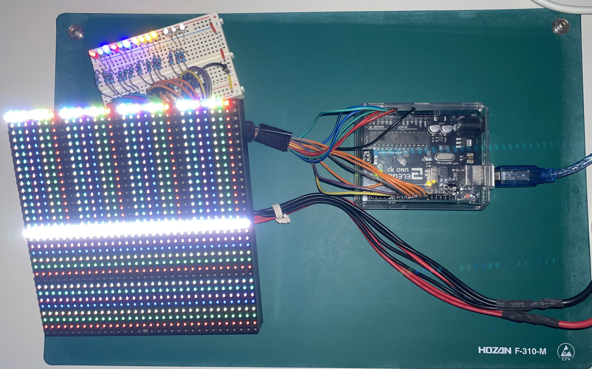

# Arduino - LEDマトリクス制御のお勉強

# 1. HW
- 制御用装置は、「Arduino UNO R3」を使用する。
- LEDマトリクスは、共立プロダクツの「32X32 RGB LEDマトリックス (型番:KP-3232D)」を使用する。

# 2. SW
- OSは、何でも良い。
- 開発環境は、「[Arduino IDE][def_url_aide]」を使用する。

# 3. 配線
レジスタ毎に分けて、効率よく制御できるように配線した。
- 制御 (DDRB)
  - Digial#05 -- CLK (シフトレジスタへの色の送り込み)
  - Digial#06 -- STB (送り込んだ色を確定する?的な感じ)
  - Digial#07 -- OE (全ドットの点灯制御)
- ライン選択 (DDRC)
  - Digial#08 -- A (ライン選択3bit目)
  - Digial#09 -- B (ライン選択2bit目)
  - Digial#10 -- C (ライン選択1bit目)
  - Digial#11 -- D (ライン選択0bit目)
- 色の設定 (DDRD)
  - Analog#00 -- R2 (下半分側の色設定(赤))
  - Analog#01 -- G2 (下半分側の色設定(緑))
  - Analog#02 -- B2 (下半分側の色設定(青))
  - Analog#03 -- R1 (上半分側の色設定(赤))
  - Analog#04 -- G1 (上半分側の色設定(緑))
  - Analog#05 -- B1 (上半分側の色設定(青))

# 4. 参考資料等
- [Arduino Uno R3][def_url_aur3]
- [KP-3232Dマニュアル][def_url_kp3232dman]

[def_url_aide]: https://www.arduino.cc/en/software
[def_url_aur3]: https://store-usa.arduino.cc/products/arduino-uno-rev3/
[def_url_kp3232dman]: https://www.kyohritsu.jp/eclib/PROD/MANUAL/kp3232d.pdf
